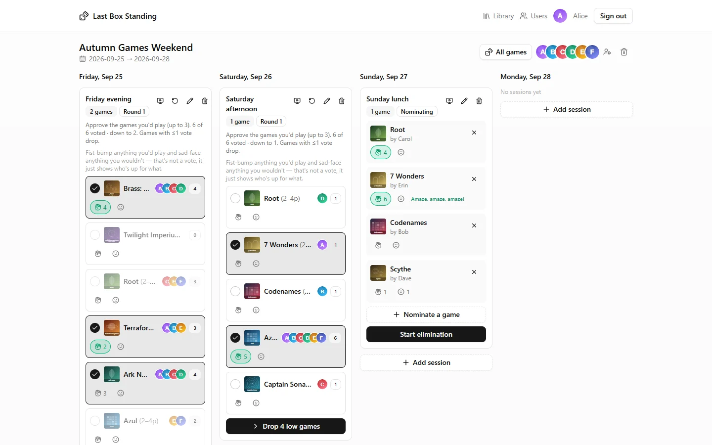
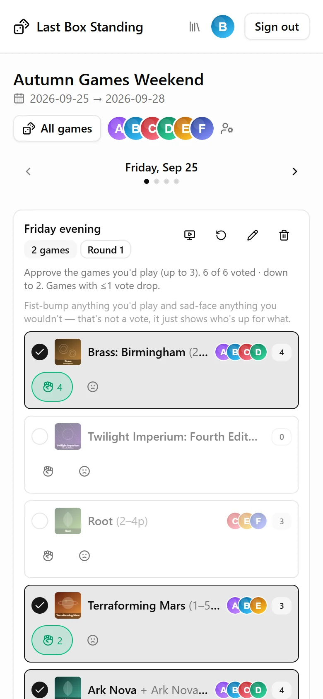
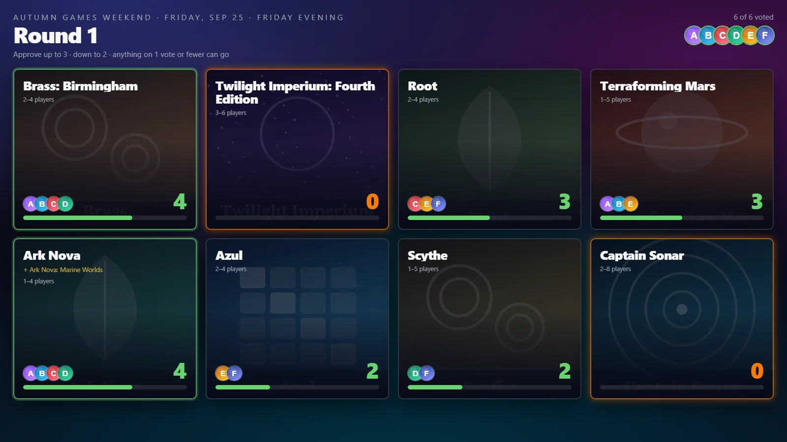
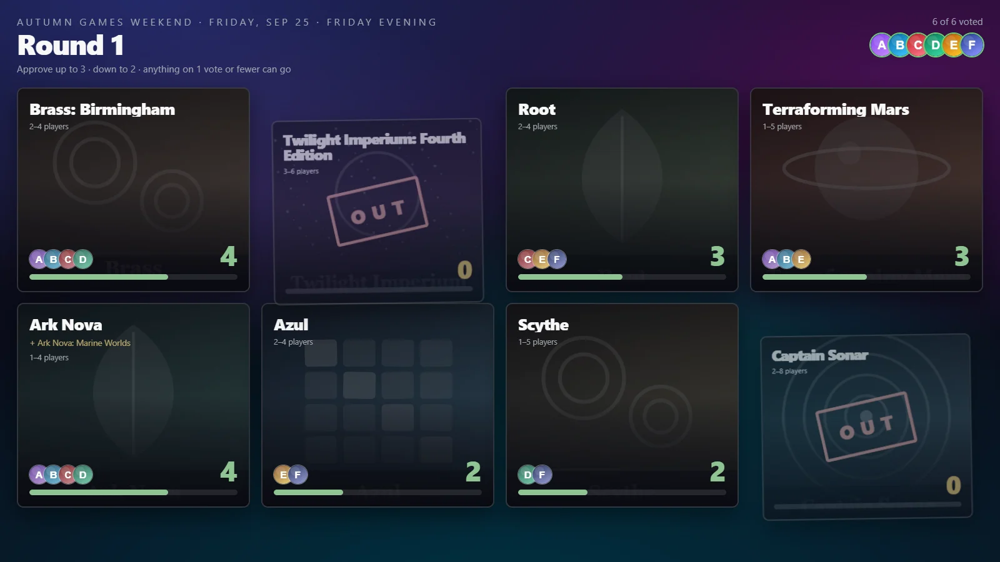
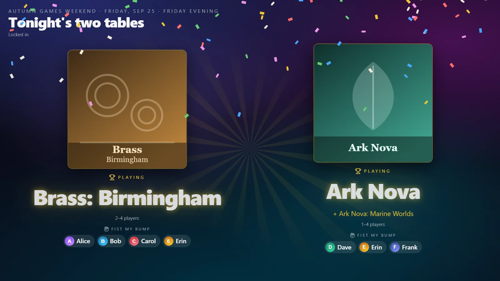

# Last Box Standing

A small web app for planning a board-game weekend with a group of friends.
Create a weekend, add sessions to its days, and let everyone decide what gets
played: people nominate games from the group's library (or BoardGameGeek),
approve the ones they'd play, and each round cuts the least-wanted until the
session is down to its game — or two, when the group splits across tables.

Built for one group of about six people. It's invite-only: an admin adds
people by email and they sign in with Google.



## Features

- **Weekends and sessions** — a Friday-to-Monday weekend, with sessions on each
  day that play one game, or two in parallel.
- **Nominate, approve, eliminate** — anyone nominates; each round everyone
  approves the games they'd play (up to three, fewer as the field narrows), and
  the least-approved drop out until the session is decided. Fist bumps show
  who'd actually sit down to what, and break ties. Voting methods are
  pluggable, so other ways of deciding can sit alongside this one.
- **Big screen mode** — project the vote on a TV while people vote from their
  phones, with a staged reveal for each cut and the winners.
- **Live updates** — every open page refreshes as votes land (server-sent events).
- **Game library** — games are fetched from BoardGameGeek once and cached;
  expansions attach to their base game and widen its player count. Track who
  owns which copy and who has it.
- **Results** — optionally record finishing order for each play.

## In action

### Voting from your phone



Each round, tick the games you'd play: up to three at first, then two, then
one as the field narrows, so the last rounds are a real choice. The fist bump
and sad face don't count as votes; they show who'd actually sit down to what,
which is how a two-game session works out who goes to which table. They only
reach the elimination to settle a tie.

### Big screen mode

Put the session on the TV and run the elimination from there while everyone
votes on their phones. Votes land live:



Each cut gets its moment:



And the reveal shows who fist-bumped each winner, so the room can split across
the two tables:



The box art and avatars here are placeholders drawn for the demo; the real app
shows art from BoardGameGeek and people's Google profile pictures.

## Stack

| Layer | Choice |
|-------|--------|
| Client | Vite + React 19 + TypeScript + Tailwind v4 + shadcn/ui + TanStack Query |
| Server | Hono (Node) — serves the API and, in production, the built SPA |
| Database | SQLite via Drizzle ORM (`better-sqlite3`) |
| Auth | Google Sign-In (OAuth); admins from env, other users managed in-app |
| Deploy | One Docker container; optional GitHub Actions push-to-deploy over SSH |

Monorepo via npm workspaces: [`client/`](client) and [`server/`](server).

## Local development

Prereqs: Node 22.9+ and npm.

```bash
npm install                 # installs both workspaces
cp .env.example .env        # repo-root .env — see below
npm run db:seed             # optional: fake users, a weekend, sessions, nominations
npm run dev                 # Vite on :5173 (browse this), API on :3000
```

For local dev, set these in `.env`:

```
NODE_ENV=development
DATABASE_PATH=./data/app.db
APP_URL=http://localhost:5173
```

**Browse http://localhost:5173.** Vite proxies `/api/*` to the server, so
there's no CORS to configure.

You don't need Google credentials to try it: in development,
`http://localhost:5173/api/auth/dev-login/<userId>` signs you in as a seeded
user (1 is the admin, 2–6 are friends). Switching users this way is the easiest
way to try voting. The route doesn't exist in production.

Other scripts: `npm run typecheck`, `npm run build`, `npm run db:generate`
(regenerate migrations after editing [`server/src/db/schema.ts`](server/src/db/schema.ts)).
Migrations apply automatically when the server starts.

## Configuration

Everything lives in the repo-root `.env` — see [`.env.example`](.env.example).

### Google OAuth

1. Google Cloud Console → **APIs & Services → Credentials**.
2. Configure the OAuth consent screen (External; "testing" is fine for a small group).
3. Create an **OAuth 2.0 Client ID** of type *Web application*.
4. Add **Authorized redirect URIs**: `<APP_URL>/api/auth/google/callback` for
   each place you run it, e.g. `http://localhost:5173/api/auth/google/callback`.
5. Put the client ID and secret in `.env` (`GOOGLE_CLIENT_ID`, `GOOGLE_CLIENT_SECRET`).

### Who can sign in

`ADMIN_EMAILS` lists the **admins**. Admins can always sign in, and are the only
ones who see the **Users** page, where they add everyone else by email. There's
no invitation flow: once an admin has added an address, that person signs in
with Google and their account is linked on first login. Anyone else is rejected.

Removing a user revokes access immediately but keeps their name on past
nominations and games; re-adding the same email restores them. Admins can't be
removed in the app — take them out of `ADMIN_EMAILS` and restart.

### BoardGameGeek

BGG's XML API needs a registered application. Register a free non-commercial
app at https://boardgamegeek.com/applications, create a token, and set
`BGG_APP_TOKEN`. Without it, BGG search is off and games can still be added by
hand. Each game is fetched from BGG once and cached in the database — please
keep it that way.

## Self-hosting

It runs as a single container that serves both the API and the built client:

```bash
cp .env.example .env    # NODE_ENV=production, DATABASE_PATH=/data/app.db,
                        # APP_URL=https://your.domain, Google creds, ADMIN_EMAILS
docker compose up -d --build
```

The app listens on port 3000; put it behind something that terminates HTTPS
(Caddy, nginx, a platform proxy) and add `<APP_URL>/api/auth/google/callback`
to your OAuth client. The SQLite database lives on the `db-data` Docker volume,
so it survives rebuilds. The volume is named after the checkout directory, so
keep deploying from the same one.

### Backups

[`scripts/backup-db.sh`](scripts/backup-db.sh) takes a consistent snapshot of
the live database using SQLite's online backup API (a plain `cp` of a WAL-mode
database misses recent writes). Run it from the checkout; snapshots land in
`backups/` (git-ignored) and the last 10 are kept.

```bash
./scripts/backup-db.sh
```

To restore, stop the app, copy a snapshot over the volume, and start it again:

```bash
docker compose stop app
docker compose run --rm --no-deps -T -v "$PWD/backups:/backups" app \
  sh -c 'rm -f /data/app.db-wal /data/app.db-shm && cp /backups/app-<timestamp>.db /data/app.db'
docker compose up -d app
```

### Push-to-deploy (optional)

[`.github/workflows/deploy.yml`](.github/workflows/deploy.yml) typechecks and
builds every push and pull request. On a push to `main`, it can also SSH into
your server and run `git pull`, the backup script, then
`docker compose up -d --build` — a failed backup stops the deploy before any
migration runs. It's off until you configure it under
**Settings → Secrets and variables → Actions**:

| Kind | Name | Value |
|------|------|-------|
| Variable | `DEPLOY_PATH` | the checkout on the server, e.g. `~/last-box-standing` |
| Secret | `DEPLOY_SSH_HOST` | server hostname |
| Secret | `DEPLOY_SSH_USER` | SSH user |
| Secret | `DEPLOY_SSH_KEY` | private key for that user |
| Secret | `DEPLOY_SSH_PORT` | *(optional)* if not 22 |

## Releases

Versions follow [semver](https://semver.org), read from the point of view of
someone self-hosting it:

- **Major:** upgrading needs you to do something by hand, like a new or
  renamed required setting in `.env` or a change to `docker-compose.yml`.
- **Minor:** new features. Database migrations included: they apply
  themselves when the server starts.
- **Patch:** fixes only.

The version lives in the root `package.json`, and `GET /api/health` reports
the one a server is running. To cut a release from an up-to-date, clean `main`:

```bash
npm version minor       # or patch / major: bumps package.json, commits, tags
git push --follow-tags  # pushes the commit and the tag together
```

Pushing the tag runs [`.github/workflows/release.yml`](.github/workflows/release.yml),
which checks the tag matches `package.json`, typechecks, and publishes a
[GitHub Release](../../releases) with notes generated from the merged pull
requests.

Going back to an older release is only safe if no migrations landed in
between. Migrations only run forward, so restore a backup instead.

## Project layout

```
client/   Vite React SPA (pages, components, hooks, api wrapper)
server/   Hono API, Drizzle schema + migrations, Google auth, BGG client
scripts/  database backup
Dockerfile, docker-compose.yml   production container
```

[`CLAUDE.md`](CLAUDE.md) has a detailed tour of the architecture and domain
model.

## License

[MIT](LICENSE)
